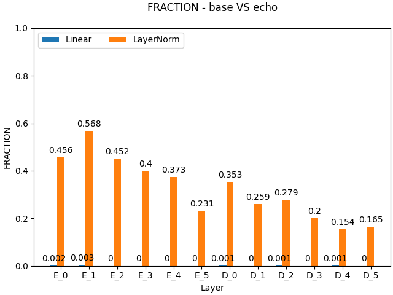

# July 30

# Experiment 1

### Motivation

Atomic circuits can solve their own test set. What about their unions? Can these combined models solve the test sets of the individual circuits used in the combination?

### Hypothesis
Yes.

### Method

| Model | Copy | Echo | Copy_Echo |
|----------|----------|----------| ----------|
| copy | 1.0 |  0.0970 | 0.5480  |
| echo | 0.0 | 1.0 | 0.5 |
| copy_echo | 1.0 | 1.0 |  1.0 |
| copy $\cup$ echo |  0.0 | 0.0783 | 0.0383 |
| echo $\cup$ copy |  0.0 | 0.0783 | 0.0383 |
| echo $\cup$ copy $\cup$ copy_echo| 0.0 | 0.4285 | 0.2075|

**Note:** We operated on all the layers and both for linear and layernorm modules.

### Findings

This does not seem to be the case. It is more complicated than initially thought. 

This **might** indicate that circuits interfere, so that the addition of one circuit to another one, messes things up unless this addition is "cancelled" out by something else. 

What is this _something else_?

# Experiment 2

### Motivation

The findings from experiment 1. Why and what is interferring?

### Hypothesis

Models learn circuits that cancel eachother out in order to solve individual atomic functions.

### Method

Remove copy from the base_model and evaluate on all atomic tasks.

Consider the circuit $\hat{E}=\bigcap_i f_i$.

Now do:

$\hat{T} = M - C + \hat{E}$, with $M$ being the base model.

If $\hat{T}$ now can still do all the atomic tasks, except $C$, then the network is compositional.

If $\hat{T}$ now fails for other tasks than $C$, then this supports the cancel hypothesis. 

### Findings:

$\hat{T} = M - C + \hat{E}$ fails on all tasks.

$f_i - \hat{E}$ also fails on all tasks.

This indicate that the base model has not learned a compositional solution to the problem. 

# Experiment 3

### Motivation

Why is the difference operation destroying the performance completely? Even where there are super sparse circuits?

Removing the xtremely sparse echo circuit from the base model, which can solve all 10 individual tasks almost perfectly, results in a model that can't do anything, even if we add back the "glue".

### Hypothesis

Each circuit contains something that is unique to that circuit but which is also crucial for solving all the other tasks.

### Method

This "something" might not be distributed equally across the layers. What happens if we only take the difference layer and component wise?

$M$ and $echo$ has some overlap. Specifically:
- In the five first layers, the encoder layernorms are completely shared. The decoder norms are also shared to a great extent.
- In all layers for both the encoder and decoder, there is little sharing between the linear layers, which are also extremely sparse (between 0.0 and 0.002).

**Removing both linear and layernorms per layer:**

| Layer | Accuracy on echo |
|----------|----------|
| 0 | 0.0 |
| 1 | 0.375 |
| 2 | 0.968 |
| 3 | 1.0 |
| 4 | 0.968 |
| 5 | 1.0 |

**Removing just the linear**

| Layer | Accuracy on echo |
|----------|----------|
| 0 | 0.687 |
| 1 | 0.468 |
| 2 | 1.0 |
| 3 | 1.0 |
| 4 | 1.0 |
| 5 | 1.0 |

**Removing just the norms**

| Layer | Accuracy on echo |
|----------|----------|
| 0 | 0.0 |
| 1 | 0.5 |
| 2 | 0.968 |
| 3 | 1.0 |
| 4 | 1.0 |
| 5 | 1.0 |
